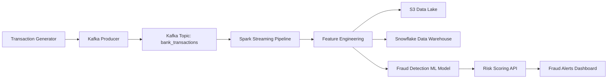
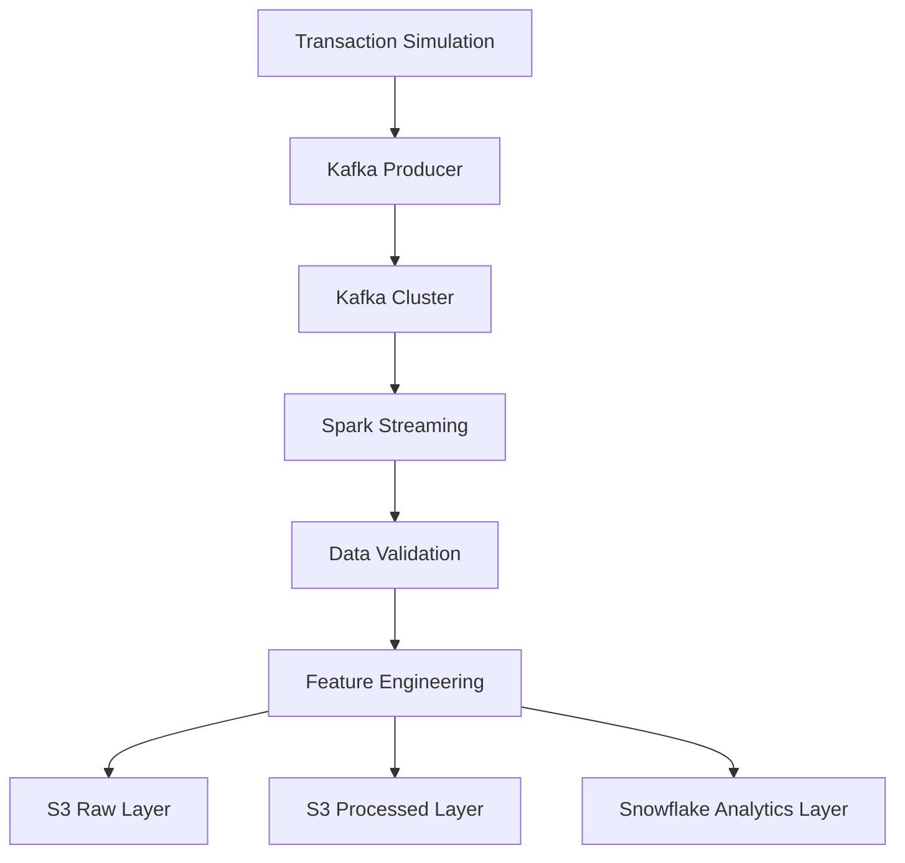
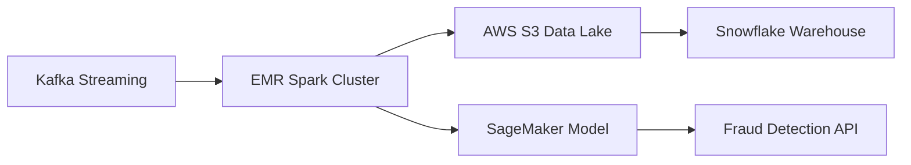

Real-time fraud detection data platform built using Kafka, Spark Streaming, AWS S3, and machine learning.
## Overview

This project implements a **real-time financial transaction fraud detection platform** using streaming data pipelines and machine learning.

The system simulates financial transactions, ingests them using Kafka, processes them with Spark Streaming, stores raw and processed data in a data lake, and applies machine learning models to detect suspicious transactions.

The platform demonstrates modern **data engineering architecture used in fintech systems such as Stripe, PayPal, and banks**.


## System Architecture


## Data Pipeline



---

## AWS Architecture



---


## Technology Stack

### Data Ingestion
- Apache Kafka
- Python

### Stream Processing
- Apache Spark (PySpark)

### Storage
- AWS S3 (Data Lake)
- Snowflake (Analytics Warehouse)

### Machine Learning
- Scikit-learn
- Isolation Forest (Fraud Detection)

### API Layer
- FastAPI

### Data Governance
- Great Expectations

### Development Tools
- Python
- Git
- PyCharm
---

## Data Flow

1. Financial transactions are generated by a transaction simulator.
2. Transactions are sent to Kafka using a Python producer.
3. Spark Streaming consumes transactions from Kafka.
4. Feature engineering is applied to create fraud detection features.
5. Raw and processed data are stored in AWS S3.
6. Machine learning models analyze transactions for anomalies.
7. Fraud risk scores are exposed through a FastAPI service.

## Project Structure

```
fraud-data-platform

data_producer/
data_pipeline/
ml_model/
storage/
api/
governance/
config/
```

---

## Features

- Real-time transaction ingestion
- Streaming fraud detection pipeline
- Machine learning based anomaly detection
- Cloud data lake storage
- Fraud risk scoring API
- Data quality validation for financial transactions


## Learning Outcomes

This project demonstrates:

- Real-time data streaming architectures
- Scalable data lake design
- Feature engineering for fraud detection
- Machine learning model integration in data pipelines
- Data governance and validation
